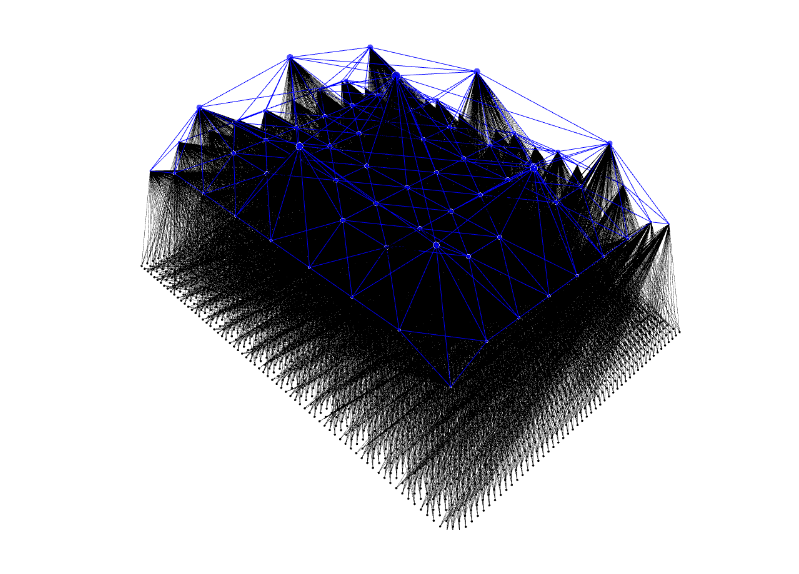
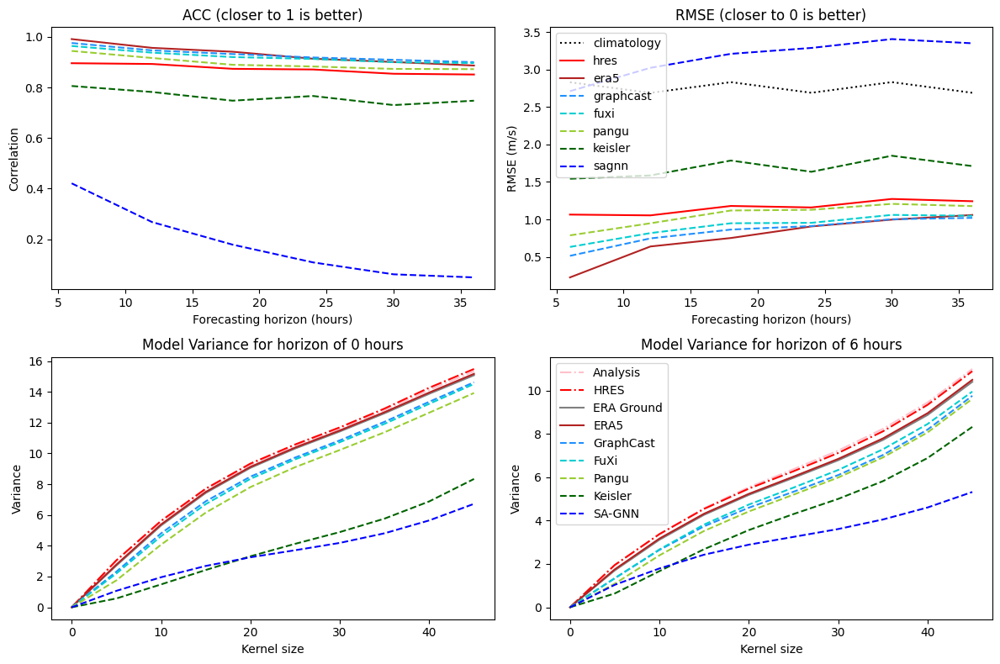

# Implementation of Neural LAM by Divan van der Bank - Creating SA-GNN

This model called **SA-GNN** is based on work done by *Oskarsson, Joel and Landelius, Tomas and Lindsten, Fredrik* and details the modification and validation of their **neural-lam model** on `ERA5 data` for the `region of South Africa`. The results of this model will be compared to **current leading AI weather prediction models** and numeric weather prediction models using a modified version of **WeatherBench** by *Rasp, Stephan*.

Find the original **NeuralLAM** repository at [NeuralLAM](https://github.com/mllam/neural-lam/tree/main)

Find the original **WeahterBench** repository at [WeatherBench](https://github.com/google-research/weatherbench2)

## For interest sake, here is an image of the graph architecture:

## And the progress to recreating and adapting the NeuralLAM model:

## With the goal to compare the SA-GNN model with current Global AIWP models and ground truth datasets

## And the first outputs of the model

